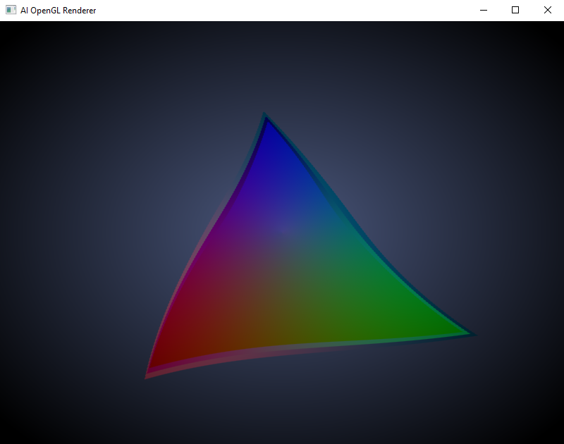

# AI OpenGL Renderer

This is a simple C++ and OpenGL project using CMake that renders a triangle in a framebuffer (g-buffer) and applies post-processing effects such as chromatic aberration, vignette, and animated vortex. 99% made by AI using GitHub Copilot with ChatGPT 4.



## Requirements

| Requirement      | Version  |
|------------------|----------|
| CMake            | >= 3.10  |
| OpenGL           | >= 3.3   |
| Python           | >= 3.6   |

## Cloning Dependencies

Before building the project, you need to clone the dependencies. You can do this by running the provided Python script:

```bash
python bootstrap/clone_dependencies.py
```

## Building the Project

1. Create a build directory:

```bash
mkdir build
cd build
```

2. Run CMake to configure the project:

```bash
cmake ..
```

3. Build the project:

```bash
cmake --build .
```

## Running the Project

After building the project, you can run the executable:

```bash
./AI-OpenGL-Renderer
```
